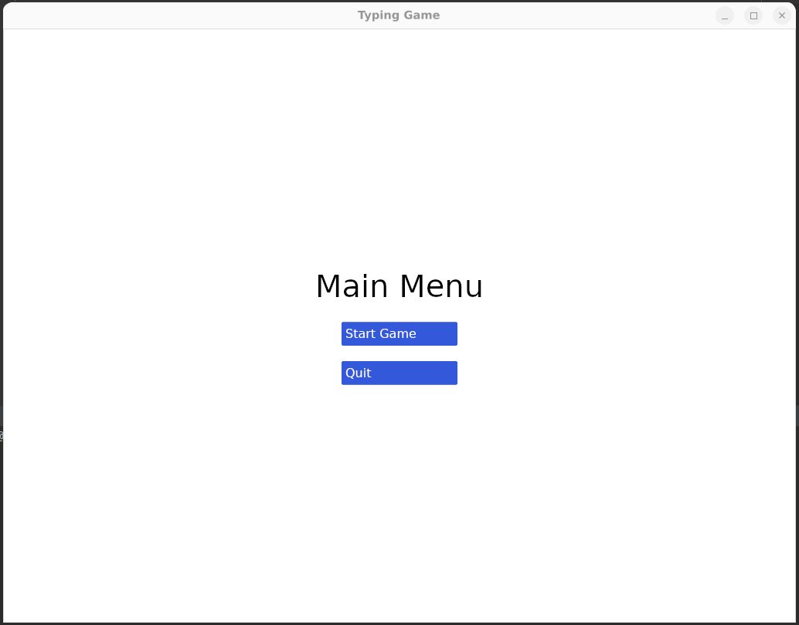
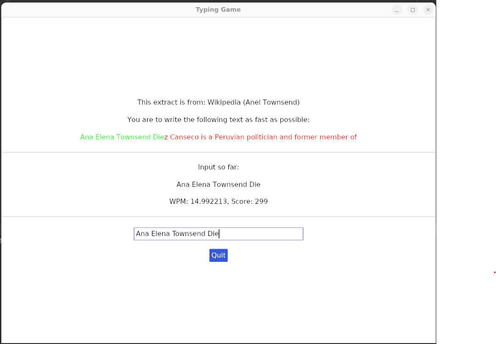
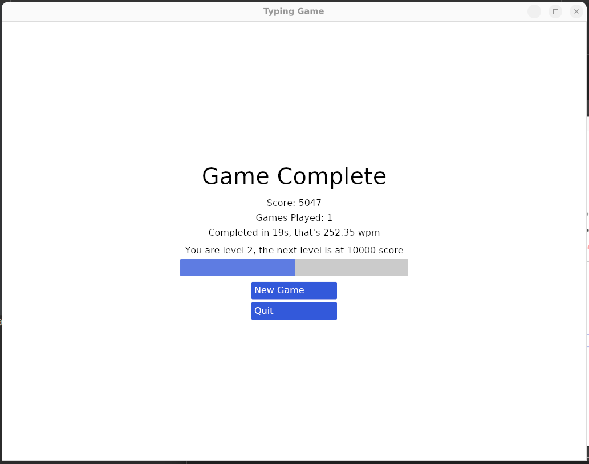
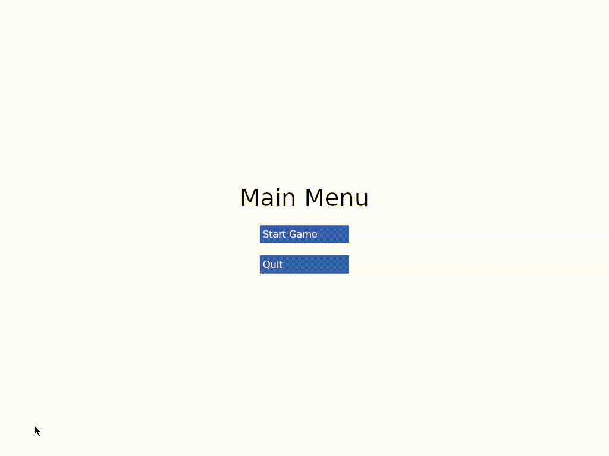

# typeracer demo

Built with the overworld library on top of the iced gui.

| Main Menu                  | Game                   | End Screen                        |
|----------------------------|------------------------|-----------------------------------|
|  |  |  |

## License

Licensed under the following licenses at your option:

- Apache License, Version 2.0 <[LICENSE-APACHE](LICENSE-APACHE) or https://www.apache.org/licenses/LICENSE-2.0>
- MIT license <[LICENSE-MIT](LICENSE-MIT) or https://opensource.org/licenses/MIT>

Files in the project may not be copied, modified, or distributed except according to those terms.
